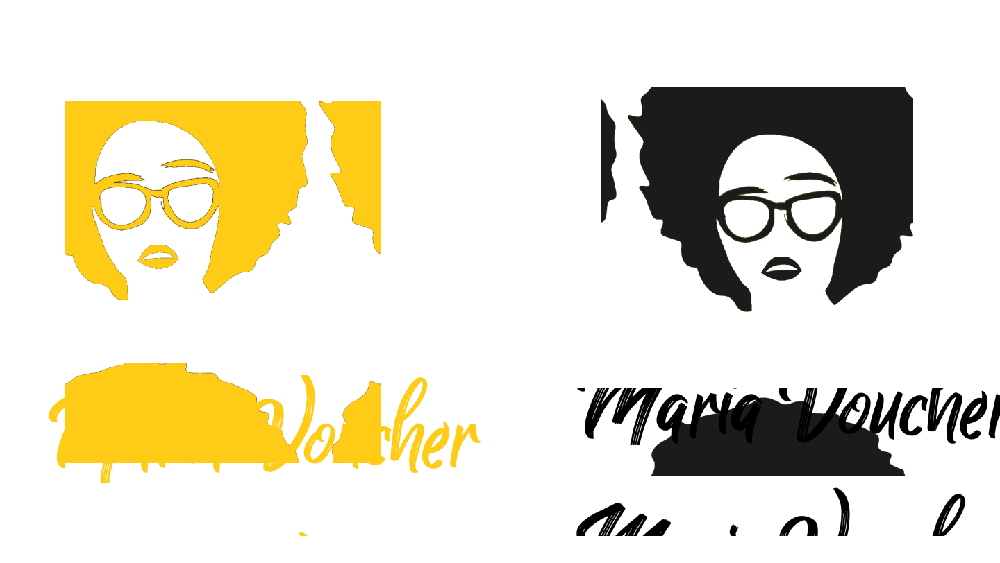

# <Maria Voucher>

## Talent Fest - Hackaton realizado realizado no bootcamp SAP006 da [Laboratória](https://www.laboratoria.la/br) em parceria com [Zé Delivery](https://www.ze.delivery/)

## Índice

1. [Definição do Produto](#dart-definição-do-produto)
2. [Histórias de Usuários](#pencil2-histórias-de-usuários)
3. [Protótipos](#art-protótipos)
4. [Como Utilizar](#gear-como-utilizar)
5. [Tecnologias Utilizadas](#robot-tecnologias-utilizadas)
6. [Sobre as desenvolvedoras](#woman_technologist-sobre-as-desenvolvedoras)

---
## 💻 Definição do Produto

Seja bem-vinde! Somos a [Maria Voucher](https://tf-ze-delivery.web.app/)
Saudades de um Happy Hour né minha filha?
Compre com Maria Voucher os melhores cupons, para seus funcionários sextar de forma segura e com qualidade.

---

<div style="display: flex">
  
</div>

<br>

<div>
 
  <h4> Você pode acessar a aplicação utilizando um dos logins de teste abaixo:</h4>

| #                     	|             Informações            	|                   	|
|:-----------------------:|:----------------------------:	|:---------------------------:	|
| 🆔	| teste-maria@gmail.com 	| 
| key                 	|            123456            	|

</div>

---
## 📃 Histórias de Usuários

**Historia de usuário 1:**  
Eu, como membro de uma empresa quero me cadastrar ou logar e ser encaminhado para o dashboard de vouchers.

**Historia de usuário 2:**  
Eu como membro de uma empresa quero definir valores, adicionar ou excluir pedidos de vouchers, e poder enviar essas informações para a página de criação de vouchers.

**Historia de usuário 3:**  
Eu como membro de uma empresa quero realizar os pagamentos dos vouchers por meio de cartão de crédito ou PIX.

---

## 💡 Protótipos 

### Paleta de Cores 
<div align="center" style="display: flex">
  
</div>

---

<div align="center" style="display: flex">
  

</div>

---
## Como Utilizar

- A tela inicial da aplicação traz a **Página de Login** que apresenta ao usário as opções de fazer o login com email e senha já cadastrados e entrar na plataforma da Maria Voucher ou prosseguir para a Página de Cadastro;
- Na **Página de Cadastro**, o usuário pode cadastrar-se inserindo seus dados de Nome, E-mail, Senha, Data de nascimento e CPF;
- Ao realizar qualquer uma dessas formas de acesso, o usuário será encaminhado para o seu respectivo ambiente:<br/>
    **Dashboard**: opções para acessar a compra ou consulta de vouchers
  


---
## 🚀 Tecnologias Utilizadas
<br>

 

 Linguagem de marcação 

  

 Linguagem de estilização

 

Linguagem de programação interpretada estrutura

 

Bibioteca do Javascript que auxilia na criação de interface

 

 Software de execução de códigos JavaScript

  

 Sistemas de controle de versões distribuídos

 

 Editor gráfico de vetor e prototipagem de projetos


---

## Estrutura dos Principais Arquivos
```
.
├── 📁public
|
├── 📁src
|   ├── 📁components
|   |   ├── 📁Button
|   |   ├── 📁
|   |   ├── 📁
|   |   ├── 📁Header
|   |   ├── 📁Input
|   |   ├── 📁
|   |   ├── 📁
|   |   ├── 📁ValidationMessage
|   |
|   ├── 📁img
|   |
|   ├── 📁pages
|   |   ├── 📁
|   |   ├── 📁
|   |   ├── 📁
|   |   |── 📁
|   |   └── 📁
|   |
|   |
|   ├── 📄
|   ├── 📄
|   └── 📄
|   └── 📄
|
├── 📄README.md
└── 📄package.json
```


---

## ✔️ Resultados

* #### Desktop


* #### Tablet


---
## 👩‍💻 Colaboradoras 


<table>
  <tr>
      <td align="center">
            <a href="#">
            <br>
            <sub>
            <b>Bruna Calixto</b><br>
            </sub>
            </a>
      </td>
    <td align="center">
      <a href="#">
        <br>
        <sub>
          <b>Sabrina Araújo</b><br>
        </sub>
      </a>
    </td>
   
  </tr>
</table>

<table width="300">
      <td>
            <a href="https://github.com/bruna-devbio/">
            <a href="https://www.linkedin.com/in/brunacalixtodevjunior/">
      </td>
      <td>
            <a href="https://github.com/sabrinaaraujo-ds">
            <a href="https://www.linkedin.com/in/sabrina-araujo-ds/">
      </td>

</table>


