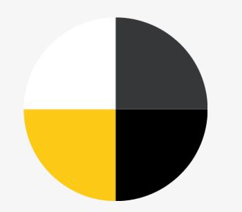
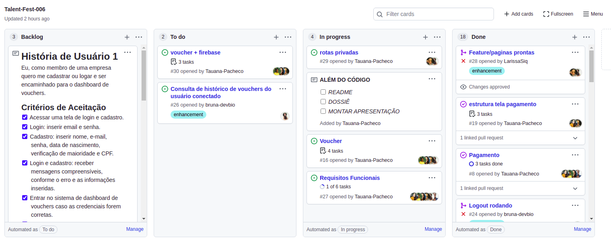
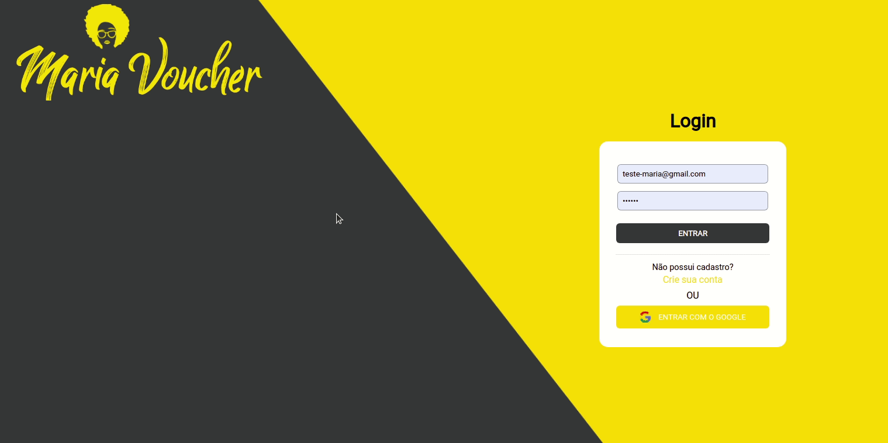
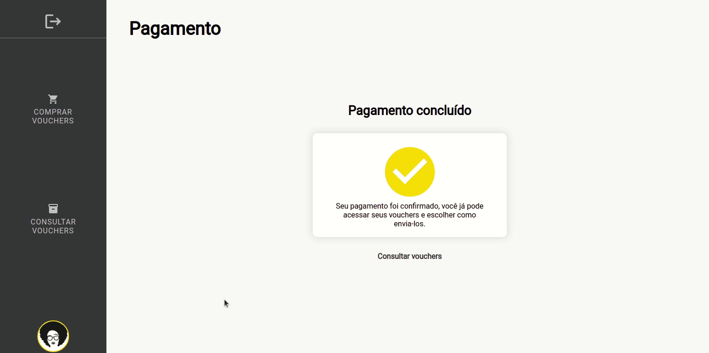
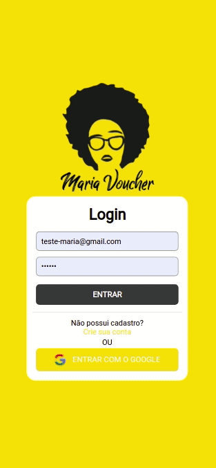
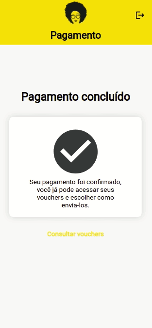

## <Maria Voucher>
 
<h1 align="center">Talent Fest</h1>

<h2 align="center"> ## Squad Zé Delivery </h2>

<h3 align="center"> ## Hackaton realizado realizado no bootcamp SAP006 da Laboratória</h3><br>

## Índice

1. [Definição do Produto](#dart-definição-do-produto)
2. [Histórias de Usuários](#pencil2-histórias-de-usuários)
3. [Protótipos](#art-protótipos)
4. [Como Utilizar](#gear-como-utilizar)
5. [Tecnologias Utilizadas](#robot-tecnologias-utilizadas)
6. [Sobre as desenvolvedoras](#woman_technologist-sobre-as-desenvolvedoras)

---

## 💻 1. Definição do Produto

Seja bem-vinde! Somos a [Maria Voucher](https://tf-ze-delivery.web.app/)
Com a chegada da pandemia, muitas empresas passaram a trabalhar de forma totalmente remota e,
por questões de segurança, os happy hours passaram a acontecer também remotamente.
Pensando nisso, surgiu a Maria Voucher, uma aplicação Web com foco em empresas que quisessem
confraternizar de forma virtual, aonde o representante da empresa possa se cadastrar, escolher a
quantidade de vouchers e seus valores, efetuar o pagamento, gerar os vouchers e compartilhar com seu time.

 --
Saudades de um Happy Hour, né, minha filha? 
Compre com Maria Voucher os melhores cupons pra toda a galera da empresa sextar de forma segura e com qualidade.
<br>

<div align="center">
  
</div>

<br>

<div align="center">
 
  <h4> Você pode acessar a aplicação utilizando um dos logins de teste abaixo:</h4>

|  #  |      Informações      |     |
| :-: | :-------------------: | :-: |
| 🆔  | teste-maria@gmail.com |
| key |        123456         |

</div>

---

## 📃 Histórias de Usuários

**Historia de usuário 1:**
<br>
- [ x ]Eu, como membro de uma empresa quero me cadastrar ou logar e ser encaminhado para o dashboard de vouchers.

**Historia de usuário 2:**

- [ x ] Eu como membro de uma empresa quero definir valores, adicionar ou excluir pedidos de vouchers, e poder enviar essas informações para a página de criação de vouchers.

**Historia de usuário 3:**

- [ x ]Eu como membro de uma empresa quero realizar os pagamentos dos vouchers por meio de cartão de crédito ou PIX.

<br>
---
<br>

## 💡 Protótipos

O processo de criação do prototipo foi pensado buscando um layout intuitivo, minimalista e de fácil compreensão.

Durante o processo, criamos a identidade visual e definimos a paleta de cores inspirada no Ze Delivery.

Usamos o Figma para desenvolver o protótipo de alta fidelidade.

### Paleta de Cores

<div align="center">
  
</div>

---

### Planejamento e Organização

O projeto foi realizado por um squad composto por 6 desenvolvedoras front-end em um prazo de 3 dias. O primeiro desafio encontrado foi fazer um planejamento no qual todas pudessem colaborar com ideias, referências e funcionalidades. Para isso, a organização e o planejamento foram feitos em conjunto através do GitHub projects, usando o método FDP (Fatiar, Dispensar e Priorizar). Essa ferramenta também foi utilizada para compartilhar referências e atribuir as tarefas individuais a serem feitas por cada integrante do squad. Tambem no GitHub trabalhamos com branch's para otimizar o trabalho em equipe.

<div align="center" >
  

</div>

---

## Como Utilizar

- A tela inicial da aplicação traz a **Página de Login** que apresenta ao usário as opções de fazer o login com email e senha já cadastrados e entrar na plataforma da Maria Voucher ou prosseguir para a Página de Cadastro;
- Na **Página de Cadastro**, o usuário pode cadastrar-se inserindo seus dados de Nome, E-mail, Senha, Data de nascimento e CPF;
- Ao realizar qualquer uma dessas formas de acesso, o usuário será encaminhado para o seu respectivo ambiente:<br/>
  **Dashboard**: opções para acessar a compra ou consulta de vouchers
- <br/>
  

---
## 🚀 Tecnologias Utilizadas

<br>

<table>
  <tr>
      <td align="center">
            <a href="#">
            <br>
            </a>
      </td>
    <td align="center">
      <a href="#">
        <br>
      </a>
    </td>
    <td align="center">
            <a href="#">
            <br>
            </a>
      </td>
   
  </tr>
</table>

<table>
      <tr>
      <td>
      <a href="#">
            <br>
            </a>    
      </td>
      <td>
            <a href="#">
            <br>
            </a>
      </td>
      <td>
            <a href="#">
            <br>
            </a>
      </td>
      </tr>

</table>

---

## Estrutura dos Principais Arquivos

```
.
├── 📁public
|
├── 📁src
|   ├── 📁components
|   |   ├── 📁Button
|   |   ├── 📁BuyVoucher
|   |   ├── 📁CardMask
|   |   ├── 📁Header
|   |   ├── 📁Input
|   |   ├── 📁InputMask
|   |   ├── 📁Modal
|   |   ├── 📁Navbar
|   |   |-  📁Orders
|   |   |   📁PayVoucher
|   |   |   📁Pix
|   |   |   📁SeeVoucher
|   |   |   📁Sidebar
|   |   |   📁Validation
|   |
|   ├── 📁img
|   |
|   ├── 📁pages
|   |   ├── 📁Dashboard
|   |   ├── 📁Login
|   |   ├── 📁PageNotFound
|   |   |── 📁Register
|   |   └── 📁Welcome
|   |
|   |
|   ├── 📄
|   ├── 📄
|   └── 📄
|   └── 📄
|
├── 📄README.md
└── 📄package.json
```

---

## ✔️ Resultados

- #### Desktop
<br>
<div align="center">
  
</div>
<br>
<div align="center">
  
</div>
<br>

- #### Mobile
<br>
<div align="center">
  
  
</div>
<br>


---
 
<h2 align="center"> 👩‍💻 Colaboradoras</h2><br>

<table align="center">
  <tr>
      <td align="center">
            <a href="#">
            <br>
            <sub>
            <b>Bruna Calixto</b><br>
            </sub>
            </a>
      </td>
    <td align="center">
      <a href="#">
        <br>
        <sub>
          <b>Sabrina Araújo</b><br>
        </sub>
      </a>
    </td>
    <td align="center">
            <a href="#">
            <br>
            <sub>
            <b>Tauana Pacheco</b><br>
            </sub>
            </a>
      </td>
   
  </tr>
</table>

<table align="center">
      <tr>
      <td>
      <a href="#">
            <br>
            <sub>
            <b>Kamila Moura</b><br>
            </sub>
            </a>    
      </td>
      <td>
            <a href="#">
            <br>
            <sub>
            <b>Larissa Siqueira</b><br>
            </sub>
            </a>
      </td>
      <td>
            <a href="#">
            <br>
            <sub>
            <b>Michele Martins</b><br>
            </sub>
            </a>
      </td>
      </tr>

</table>
